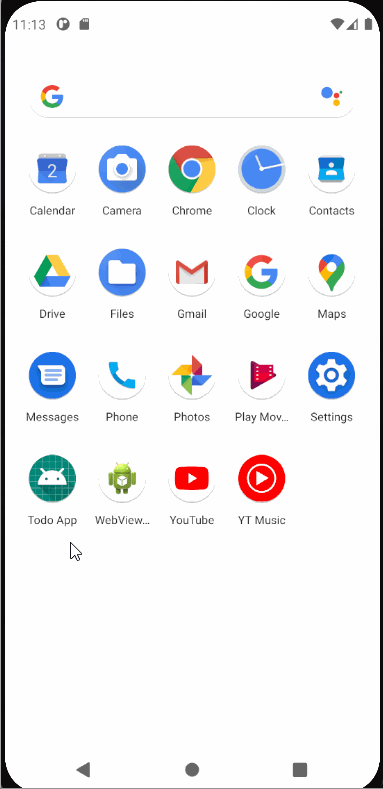
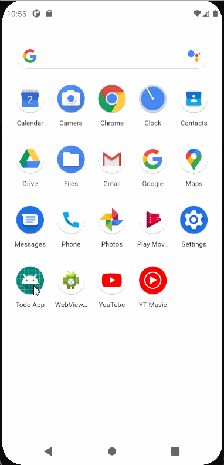
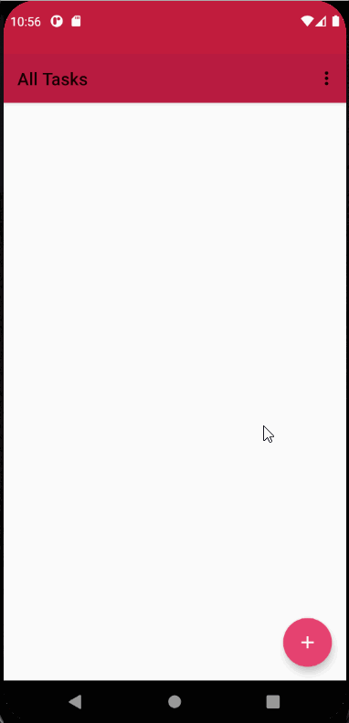
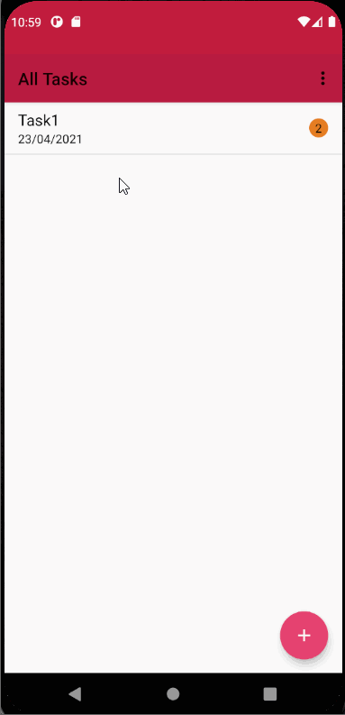
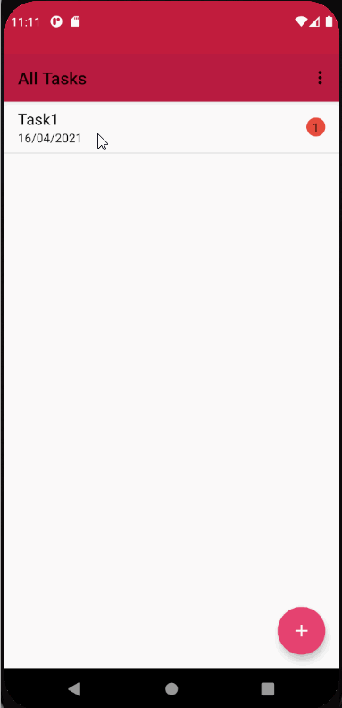
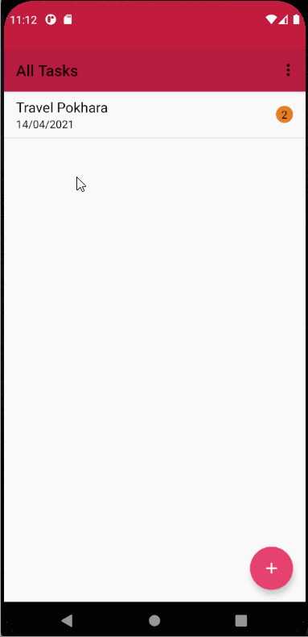
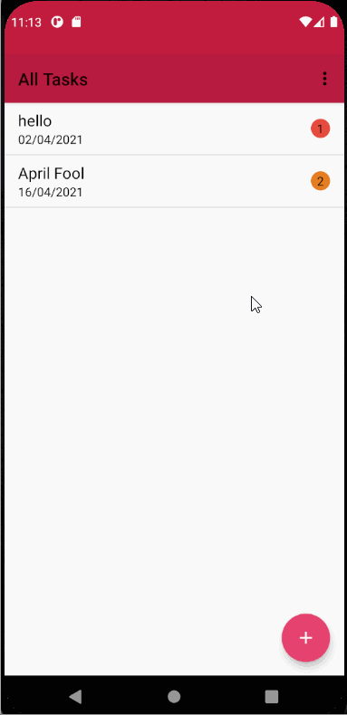
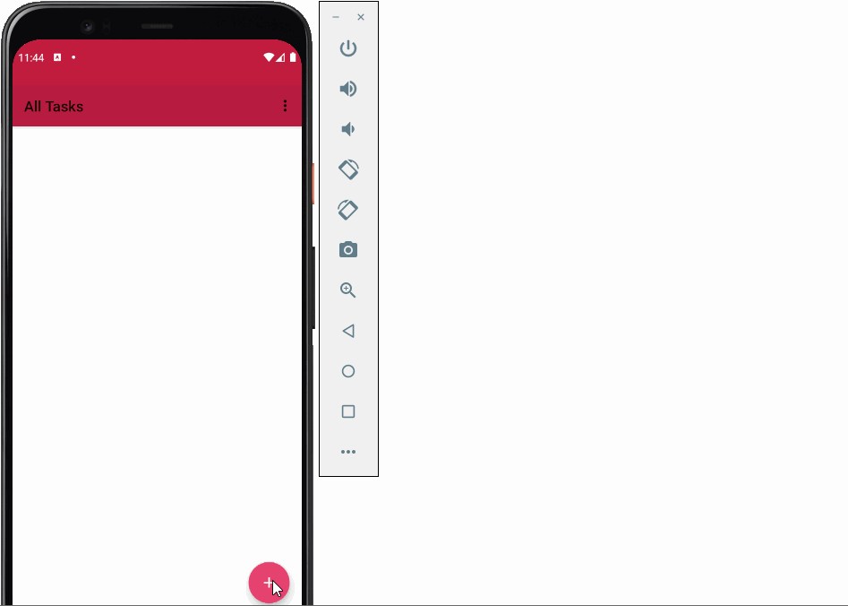

# Todo App
This is a simple todo application. It has the features to add, update and delete task.

## App Demo
Demo of the application.

## Splash Screen
On clicking the app, a splash screen will appear at first, then the main activity appears.

## Task Add
Clicking on the + button at the right bottom of the screen opens a screen from where users can add task. The task has properties like task name, due date and priority.

## Task Update
Clicking on the task in the screen takes user to the activity from where task can be updated by clicking update button.

## Task Delete
Task can be deleted either by swiping left/right or clicking on the task and clicking on delete button. On click, a dialog box appears to confirm users choice. Clicking on delete will delete the task.

<table>
<tr>
<td>By clicking on the task</td>
<td>By swiping right or left</td>
</tr>
<tr>
<td></td>
<td></td>
</tr>
</table>

## Delete All Task
All tasks can be deleted at once by clicking on the menu option and choosing delete all task. After that, a dialog box appears to confirm users choice. Clicking on delete will delete all tasks.

## Data saved on rotation
onSaveInstanceState is used to save important data before the activity is destroyed. On activity resume, we can restore those data.

